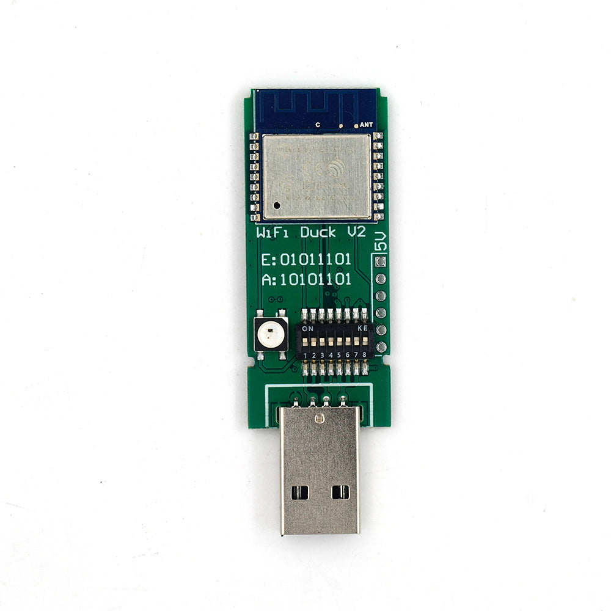
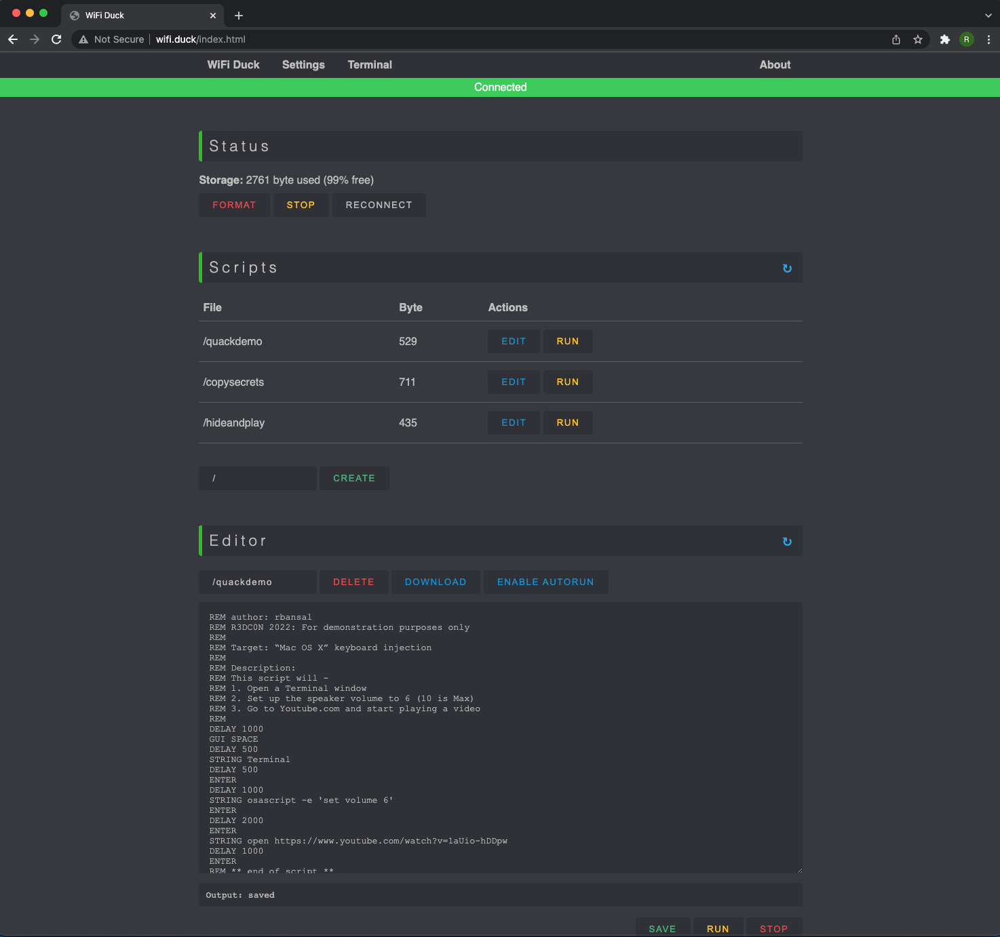
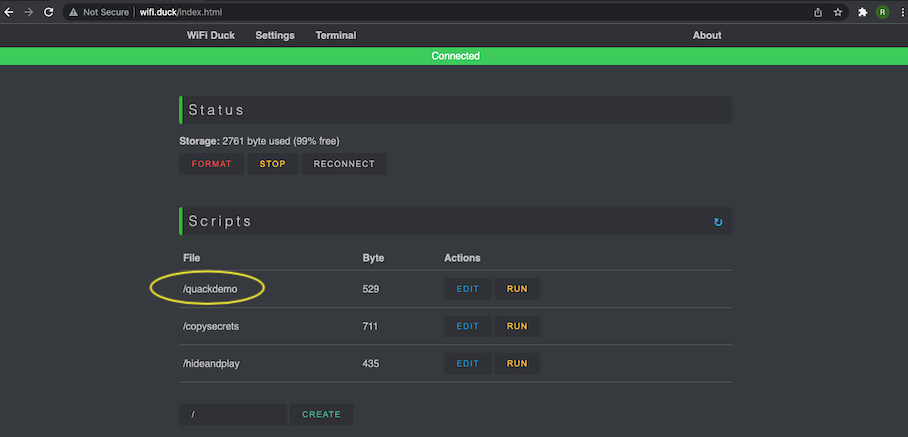
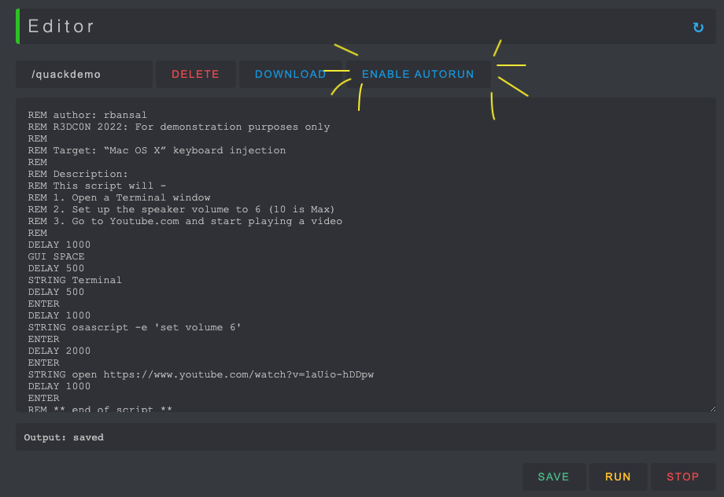
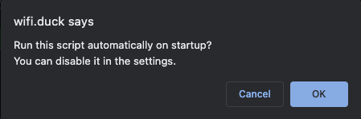

# Wifi-Duck-USB-Workshop
Wifi Duck workshop for R3DC0N Village Booth

Keyboard injection attacks are a great reason to keep your computer locked and not leave it from your vision. Step into the shoes of an adversary and learn how to create a keyboard injection exploit using a Wifi Duck.

> **The purpose of this tutorial is educational and awareness only. Do not create any malicious exploits that put Intuit's employees, customers, or their data at risk.**  
> The Wifi Duck uses keystroke injection technology that can be used to run malicious code quickly and easily on a device—serving as an unsuspecting way to: 
> - steal passwords
> - install "backdoors" into systems, 
> - installing malware, 
> - exfiltrate data,
> - modifying data, 
> - defacement, etc.  
> You must have heard a clichè "With Knowledge Comes Responsibility". Please make sure you use the Wifi Duck with acceptable exploits only for the purpose of your own edification. 
If you are unsure what an acceptable exploit is, please talk to an administrator of this workshop.

## Content

1. Description
2. Setup
3. [Syntax: Learning Ducky script](/SYNTAX.md)
4. Creating the Exploit Payload
5. Enabling the Exploit Payload onto the Wifi Duck USB
6. Running the Exploit Payload

## Description

The WiFi Duck is a project created by Stefan Kremser, also known as Spacehuhn. With it, you can plug the WiFi Duck into a target computer that's exposed even for just a minute, then connect to it over Wi-Fi from another device to issue whatever payloads you have ready or can build before you have to disconnect.

More details can be found in Stefan's repo:
https://github.com/SpacehuhnTech/WiFiDuck

The Wifi Duck V2 looks like:

It comes with the plastic casing that can be put together to give a disguised look of the Wifi Duck being an "innocent looking" USB drive.

(Note: If you'd like to mess up with switches and drivers on the USB board, leave the casing as is and do not enclose the USB device in it. Once the casing is put together, it can be pretty hard to take it apart.)

## Setup

By courtesy of @skennedy6, the Wifi Duck has already been pre-set up for you. You should be able to see a script ([quackdemo.txt](./sample_scripts/quackdemo.txt)) pre-installed for you to test the Wifi Duck.

For your knowledge, complete instructions on how to set up (also known as re-flash) your Wifi Duck are also available at https://github.com/SpacehuhnTech/WiFiDuck (Look for the link for the tutorial that takes you to a [Youtube video](https://www.youtube.com/watch?v=e3-nsOjclsY))

## Ducky Script

Ducky Script is the language of the USB Rubber Ducky. 

Ducky Script is the payload language of Hak5 gear, produced by the [Hak5](https://hak5.org/) group.

**SYNTAX**
Ducky Script syntax is simple. Each command resides on a new line and may have options follow. Commands are written in ALL CAPS, because ducks are loud and like to quack with pride. For the detailed overview of the Ducky Script, take a look at the [page](/SYNTAX.md).

** Running the Exploit Payload

Usage
Plugin your WiFi Duck
Connect to the WiFi network wifiduck with the password wifiduck
Open a browser and visit 192.168.4.1
Write, save and run your first script
[Recommended] Open Settings (top right corner) and update SSID and password

## Creating the Exploit Payload

Follow the instructions given below to create your own payload:

1. Plug in the Wifi Duck into your laptop.

> When properly plugged in, you should be able to see green light flashing on the Wifi Duck unless your Wifi Duck is enclosed in a plastic case. If there is no light, the Wifi Duck probably needs a re-flash with new drivers. 
> You may need to acknowledge your laptop to treat the Wifi Duck as a keyboard. (Wait! What? Your laptop assumed its a keyboard? That's pretty dang-tastic!)

2. On your Wifi Network list, look for Wifi Duck to change your Wifi network to Wifi Duck. 

3. Open a browser and go to wifi.duck 

> By default, the user name and pwassword is wifiduck. Once connected, you should go to Settings and change the password so nobody in your vicinity can get into your network.

4. The web interface page should show up as shown below:  

5. There should a test script, quackdemo.txt, pre-loaded on your Wifi Duck. Select this script and Edit. Go through the commands to get an idea of what this script will do. 

6. Enable AutoRun 

Acknowledge the message. 

7. Plug out the Wifi Duck and switch your Wifi back to your original network.

8. Plug in the Wifi Duck back and watch it acts like a ... (guess what!) 
... 
... 
... (get your brain juice going) 
... 
... 
... you guessed it right! A KEYBOARD!!

By this time, your laptop has placed a genuine trust in your device and believes it IS a keyboard and so it should execute as if there is a human on the other side typing in and submitting the commands to get executed.

Congratulations!! You have witnessed a keyboard injection tool running on your own laptop.

Now what?

Take a step back. 

Sip a cup of coffee if you have to. 

Think about what adversaries could do if they could access your laptop with this device, while you are busy watching football in a sports bar or stepped off your seat in an airplane to use the restroom, while leaving your laptop at your seat - open or locked.

Hold on! Even if my laptop is locked?

Unfortunately, Yes! It only takes a smart adversary who knows how to elevate privileges using assembly language etc. to execute the scripts in a locked laptop. 
So, why take a chance?

Your best choice might be taking your laptop with you, wherever you go in the public place.

Still got some coffee left in that cup?

We invite you to skim over some of the [sample scripts]((./sample_scripts) we wrote for you. Try a couple! Have fun!

As always, your R3DC0N team is here to help answer any questions. please feel free to reach out to us via intuit-r3dc0n channel on Slack or directly contact us.

And remember! **Security is Everybody's Responsibility!!**

Thank you for playing with us today! 

